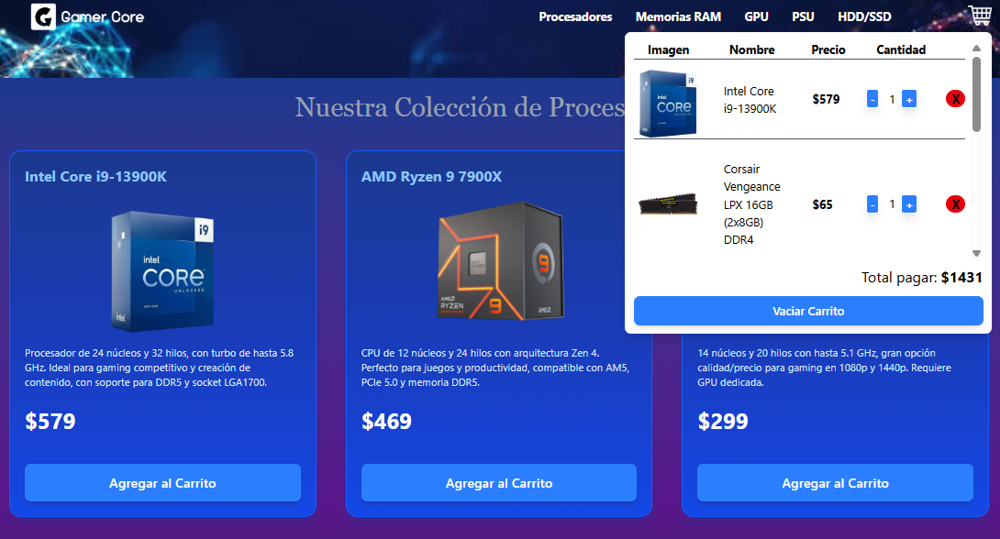

# 🖥️ GamerCore - E-Commerce de Hardware y Accesorios Gamer

GamerCore es un **e-commerce diseñado para una tienda de computadores y periféricos gamer**, desarrollado con **React + TypeScript**.  
El proyecto simula una experiencia de compra real, con navegación por secciones, un carrito interactivo y control de productos.

🔗 **Demo en vivo**: [https://gamer-core-ecommerce.vercel.app/](https://gamer-core-ecommerce.vercel.app/)  
🌐 **Portafolio**: [https://portfolio-drab-six-76.vercel.app/](https://portfolio-drab-six-76.vercel.app/)

---

## ✨ Características principales

- 🗂️ Navegación por secciones con diferentes categorías de productos (tabs).
- 🛒 Carrito desplegable al pasar el puntero:
  - Añadir productos.
  - Aumentar/disminuir cantidad.
  - Eliminar ítems individuales.
  - Vaciar carrito completo.
- ⚡ Interfaz rápida y responsiva gracias a **Vite + TailwindCSS**.
- 🔄 Navegación fluida entre páginas con **React Router**.

---

## 🛠️ Tecnologías utilizadas

- **React 19** + **TypeScript**
- **Vite**
- **TailwindCSS**
- **React Router DOM**

---

## 📸 Vista previa

